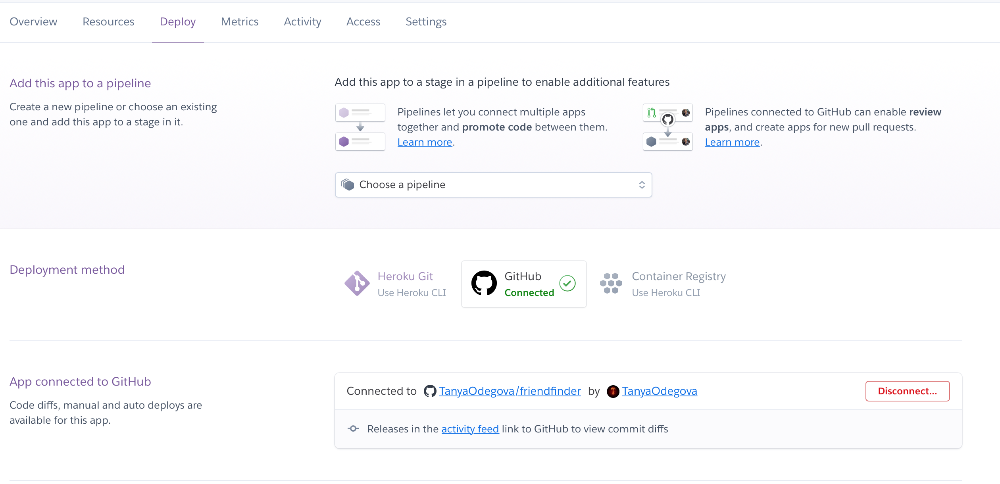
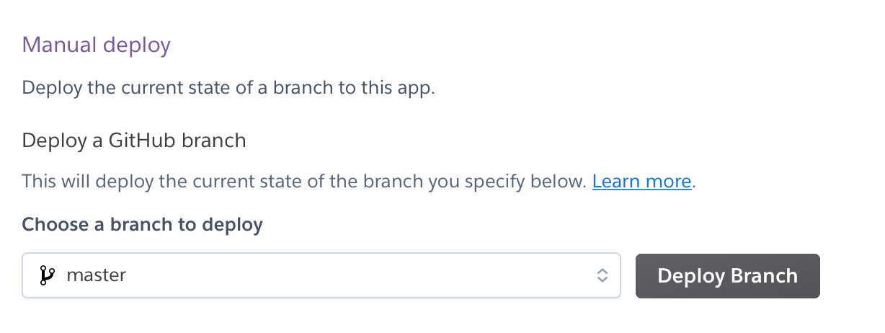

README file helpful tutorial can be found [here](https://www.youtube.com/watch?v=HUBNt18RFbo "Markdown crash course")
<!-- Headings -->
# Friend Finder App
## Summary
A Friend Finder app resemples a dating app but for friends. for this application I used Node and Express. The user enters the page that leads them to a survey. When the user submits the answers to the survey, they are matched with a "friend" that has the closest match to their personality. *Of course I could not miss this opportunity to make a survey based "Friends" characters.*

## Technology used:
Node, Express, and Heroku
## Where to start:
---
* Inside server.js file establish connection and use port 8080, we will use a different port to host the entire application locally.
```javascript
// Dependencies
var express = require("express");
var bodyParser = require("body-parser");
var path = require("path");
var app = express();
var PORT = process.env.PORT || 8080;
```
* In the routes folder establish the routes GET and POST. You will use GET to get data from the friend.js file. 
```javascript
  app.get("/api/friends", function(req, res) {
        res.json(friends);
    });
```
And

* You will use POST to display a name and photo of the character who matches user's answers the most.
```javascript
 app.post("/api/friends", function(req, res) {
        console.log(req.body.scores);

        var user = req.body;
```
* You will have to store in the friends.js file an array of friends.
Each "friend" in the array should have these properties: name, photo, and the scores - an array of answers appropriate for this character.
```javascript
var friends = [
    {
        name: "Ross",
        photo: "static/assets/images/ross.jpg",
        scores: [5,1,1,1,1,1,2,1,4,5]
    },
```
---
## NODE modules:
- Dowload body parser and express node packages.
```bash 
npm install
```
I have also dowloaded some additional packages to help me structure my work and debug issues. Such as: chalk, path,lodash, etc.
```javascript
 "dependencies": {
        "body": "^5.1.0",
        "body-parser": "^1.19.0",
        "chalk": "^2.4.2",
        "express": "^4.16.4",
        "i": "^0.3.6",
        "lodash": "^4.17.11",
        "parser": "^0.1.4",
        "path": "^0.12.7"
  }
```

3. Url to the heroku app-->
[Live link](https://friendfindertanyao.herokuapp.com/)

*To see demo please follow the link below:*
[friend finder demo](https://youtu.be/MTUMlyfGy3o)
---
---
## Important note regarding Heroku deployment:
Link your github repo to your heroku app and allow automaic deployment.

If you were fixing issues on your local machine after you have already deployed your app to heroku, I suggest to check the build under Activity tab and use Manual deploy to push the latest code to your deployed app. 

Otherwise your changes will remoin only on your local machine and your repo.


